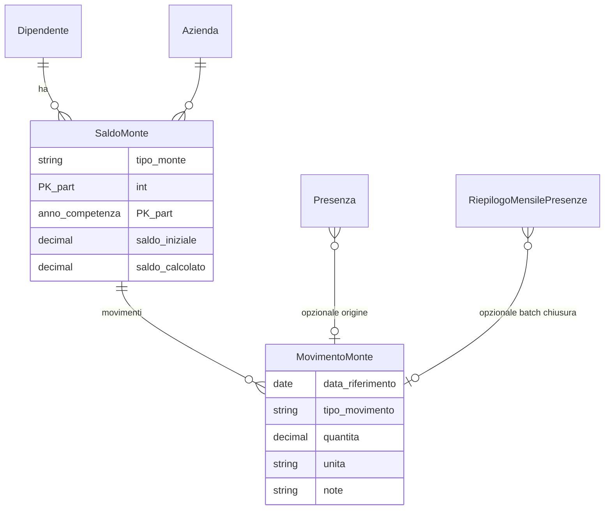

# Presenze — Fase B: schema dati e integrazioni

**Prerequisito:** [PRESENZE_MOTORE_FASE_A.md](./PRESENZE_MOTORE_FASE_A.md) compilata e approvata nei punti essenziali (causali, output mensili, chiusura mese).

**Scopo:** definire **entità**, **relazioni** e **flussi di aggiornamento** per monti (ferie, ROL, riposi compensativi), saldi iniziali, riconciliazione con il consulente — senza duplicare logicamente ciò che già esiste altrove, ma collegandosi dove ha senso.

---

## 1. Principi

1. **Separazione**: il **giornaliero** (`Presenza`) registra i fatti; il **mensile** (`RiepilogoMensilePresenze`) aggrega competenze ore; i **monti** sono un **libro giornale** (movimenti + saldo) per tipo diritto.
2. **Una sola fonte di verità per saldo operativo**: il gestionale mantiene `saldo = saldo_iniziale + Σ movimenti` per dipendente, tipo monte, anno di competenza (o periodo definito in Fase A).
3. **Cedolino / consulente**: i dati importati da busta paga (es. modelli in `documenti`) servono per **controllo** e **allineamento**, non per sostituire il calcolo interno senza regole esplicite.
4. **Immutabilità dopo chiusura**: quando il mese presenze è “chiuso”, i movimenti generati da quel mese non si modificano senza rettifica tracciata.

---

## 2. Stato dell’arte nel codice (riferimento)

| Area | Dove | Ruolo |
| ---- | ---- | ----- |
| Presenze giornaliere | `presenze.Presenza` | Causali, orari |
| Aggregato mensile ore/assenze | `presenze.RiepilogoMensilePresenze` | Output verso motore paghe (`aggrega_presenze_per_motore`) |
| Contratto / ferie annue tabellari | `rapporto_di_lavoro.RapportoDiLavoro`, `ParametroCCNLTurismo`, `RegolaNormativaCCNL` | Diritti “da contratto” |
| Snapshot su cedolino | `documenti` (campi `ferie_*`, `perm_*`, `rol_*`, `fest_*` su modello busta) | **Risultato** consulente per mese — utile a **riconciliazione**, non è un ledger operativo |
| Richieste dipendente | `richieste` | Workflow ferie/permessi (se usato) |

**Gap (da colmare in Fase B implementativa):** ledger monti con movimenti e saldi; saldi iniziali migrazione.

---

## 3. Modello concettuale (entità)

- **`tipo_monte`** (esempi): `FERIE_GG`, `ROL_ORE`, `RIPOSI_COMP` — l’elenco definitivo viene dalla Fase A (glossario).
- **`anno_competenza`**: anno di maturazione / godimento secondo policy aziendale (solitamente anno solare o anno ferie).
- **`MovimentoMonte.tipo_movimento`**: es. `MATURAZIONE`, `GODIMENTO`, `RETTIFICA_HR`, `IMPORT_CONSULENTE`, `ANNULLAMENTO`.

---

## 4. Proposta di modelli Django (bozza specifica)

_Nomi indicativi; da confermare prima delle migration._

### 4.1 `SaldoMonteDipendente` (1 riga per dipendente × azienda × tipo monte × anno competenza)

| Campo | Tipo | Note |
| ----- | ---- | ---- |
| dipendente | FK | |
| azienda | FK | |
| tipo_monte | CharField / choices | Allineare a enum condiviso |
| anno_competenza | PositiveSmallInteger | |
| saldo_iniziale | Decimal | Da migrazione / ultima busta |
| data_saldo_iniziale | Date | Taglio dichiarato |
| note | TextField | Es. “importato da busta 12/2025” |
| ultimo_aggiornamento | DateTime | |

**Saldo corrente:** sempre `saldo_iniziale + Σ movimenti` (proprietà calcolata o campo denormalizzato aggiornato a ogni movimento).

### 4.2 `MovimentoMonte`

| Campo | Tipo | Note |
| ----- | ---- | ---- |
| saldo_monte | FK → SaldoMonteDipendente | |
| data_movimento | Date | Giorno di competenza |
| tipo_movimento | CharField | Vedi sopra |
| quantita | Decimal | Positivo = a favore dipendente, negativo = godimento (convenzione da fissare) |
| unita | CharField | `GG` / `ORE` |
| origine | CharField | `PRESENZA` / `RIEPILOGO_MENSILE` / `MANUALE` / `IMPORT` |
| presenza | FK nullable | Se il movimento nasce da un giorno |
| riepilogo_mensile | FK nullable | Se generato in chiusura mese |
| utente | FK nullable | Chi ha registrato rettifica |
| idempotency_key | CharField nullable | Evita doppi movimenti stesso mese |

### 4.3 Chiusura mese (workflow)

Opzioni (sceglierne una in implementazione):

- **A)** Estendere `RiepilogoMensilePresenze` con `data_chiusura`, `chiuso_da` (se non già coperto da `stato`).
- **B)** Tabella `ChiusuraMesePresenze(azienda, anno, mese, stato, ...)` che blocca modifiche a `Presenza` per quel periodo.

La Fase A (sez. 6) deve indicare quale modello di autorizzazione usate.

---

## 5. Collegamento con `aggrega_presenze_per_motore`

Flusso suggerito **dopo** che la logica monti è pronta:

1. Chiusura mese (o azione “conferma riepilogo”) legge `Presenza` del mese.
2. Aggiorna `RiepilogoMensilePresenze` (come oggi).
3. **Genera `MovimentoMonte`** per ferie/ROL/riposi da causali e quantità già definite in Fase A (es. −X gg ferie da `giorni_ferie_godute`, −Y ore ROL da `ore_permessi_goduti`), **una sola volta** per mese (idempotency).

Fino a che il ledger non esiste, il punto 3 resta “da fare a mano” o assente: il riepilogo mensile continua a mostrare solo **goduto**, non **residuo**.

---

## 6. Riconciliazione consulente

| Dato | Fonte interna | Fonte esterna | Azione |
| ---- | --------------- | ------------- | ------ |
| Residuo ferie a fine mese | `SaldoMonte` + movimenti | Campi `ferie_*` su busta in `documenti` (se importati) | Report differenze |
| ROL | Idem | `rol_*` | Idem |

Implementazione minima: **report** mensile CSV/PDF con colonne: dipendente, saldo nostro, valore consulente (opzionale manuale), delta.

---

## 7. Fasi di implementazione (consigliate)

| Fase | Contenuto | Rischi se saltata |
| ---- | --------- | ----------------- |
| **B1** | Migration `SaldoMonteDipendente` + `MovimentoMonte`, admin read-only | — |
| **B2** | Servizio `applica_movimenti_da_riepilogo(mese)` idempotente | Doppi scarichi |
| **B3** | UI saldi + import saldo iniziale + report riconciliazione | Dati inconsistenti |
| **B4** | Blocco modifiche presenze a mese chiuso | Contesti incoerenti |

**Riferimenti codice (implementato):** `presenze/models.py` (B1), `presenze/monte_ledger.py` + `monti_saldi` / export CSV (B2–B3), `presenze.utils.presenze_mese_bloccate` e viste calendario/salvataggi (B4). Chiusura mese = `RiepilogoMensilePresenze` in stato `approvata` o `elaborata`.

---

## 8. Checklist prima di aprire le migration

- [ ] Tipi monte e unità (gg vs ore) definiti in Fase A
- [ ] Convenzione segno movimenti (+/−) scritta
- [ ] Regole: un movimento di chiusura mese per tipo monte o dettaglio giorno per giorno
- [ ] Accordo su anno competenza (solare vs ferie aziendali)

---

## 9. Prossimo passo

1. **Fase C**: casi di test numerici — vedi [PRESENZE_MOTORE_FASE_C.md](./PRESENZE_MOTORE_FASE_C.md).
2. Allineare la checklist §8 ai valori effettivamente usati in produzione (se non già fatto).

**Referente implementazione B1:** _______________  
**Data prevista:** _______________
